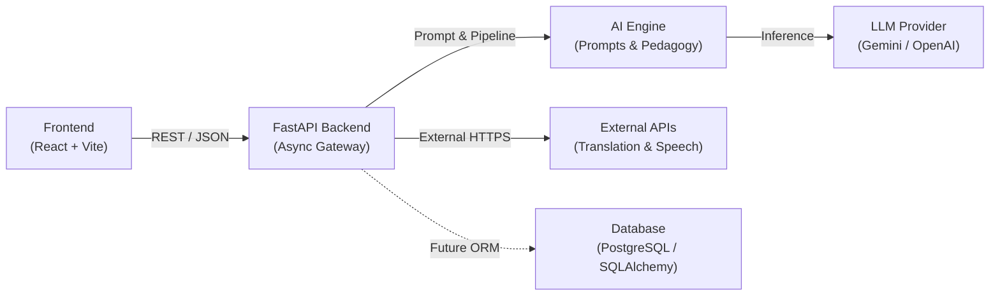

# EDUNEXIS System Architecture 🏛️

> **Smart India Hackathon 2026**  
> Multilingual, AI-Driven Adaptive Learning Platform

---

## 1. High-Level Architectural Blueprint

EDUNEXIS is structured using a clean, decoupled, tiered architecture that separates the user interface, API gateway, intelligent processing pipelines, and data storage.



```text
┌─────────────────┐       HTTP / JSON       ┌────────────────────────┐
│    Frontend     │ ──────────────────────> │    FastAPI Backend     │
│ (React 18+Vite) │ <────────────────────── │ (app/api, app/services)│
└─────────────────┘                         └───────────┬────────────┘
                                                        │
                      ┌─────────────────────────────────┼──────────────────────────────┐
                      ▼                                 ▼                              ▼
          ┌───────────────────────┐         ┌─────────────────────────┐   ┌────────────────────────┐
          │       AI Engine       │         │   External Cloud APIs   │   │     Database Layer     │
          │  - Pedagogy Engine    │         │  - Machine Translation  │   │  (app/database, models)│
          │  - Language Detector  │         │  - Speech-to-Text (STT) │   │  - Architecture Ready  │
          │  - LLM Service        │         │  - Text-to-Speech (TTS) │   │  - PostgreSQL / SQLite │
          └───────────────────────┘         └─────────────────────────┘   └────────────────────────┘
```

---

## 2. Layer-by-Layer Architectural Breakdown

### 2.1. Frontend Layer (`frontend/`)
- **Technology**: React 18 / 19, Vite, Vanilla CSS design tokens.
- **Responsibilities**:
  - Delivers a responsive, accessible, dark/vibrant user experience.
  - Manages student interaction state (query input, audio recording, language selector, reading level toggle).
  - Interacts with the backend solely through `src/services/api.js` using REST conventions.
- **Key Separation**:
  - `src/components/`: Pure UI components independent of backend implementation details.
  - `src/pages/`: Route views assembling feature components.
  - `src/services/`: Network clients isolated from UI state.

### 2.2. FastAPI Backend Gateway (`backend/app/`)
- **Technology**: Python 3.11, FastAPI, Pydantic v2, Uvicorn.
- **Responsibilities**:
  - Acts as the central orchestrator and security boundary.
  - Provides request validation and serialization through Pydantic schemas (`app/schemas/`).
  - Implements CORS middleware allowing requests from `FRONTEND_URL`.
  - Exposes health monitoring (`/health`) and modular API routes (`/api/v1/...`).
- **Design Pattern**:
  - Thin controllers (`app/api/routes/`) delegate immediately to business logic services (`app/services/`).
  - No database or AI model logic is written inside route handlers.

### 2.3. AI Engine & External Services (`ai-engine/` & External APIs)
- **Technology**: Modular Python modules, Abstract Base Classes, Prompt Engineering templates.
- **Sub-modules**:
  - **`ai-engine/prompts/`**: Standardized system prompts and instruction scaffolding for varying pedagogical levels.
  - **`ai-engine/pedagogy/`**: Simplification algorithms, concept extraction, and readability scoring.
  - **`ai-engine/language/`**: Unicode script heuristics and language identification.
  - **`ai-engine/services/`**: Pluggable LLM interface (`BaseLLMService`) supporting mock mode for local testing and live providers (Gemini, OpenAI, Hugging Face) for production.
- **External Integrations**:
  - Machine translation services (e.g., Bhashini API, Google Cloud Translation).
  - Speech processing services (e.g., Whisper, Bhashini STT/TTS, Google Speech).

### 2.4. Database Layer (`backend/app/database/` & `backend/app/models/`)
- **Design Status**: Architecture-ready.
- **Strategy**:
  - The repository maintains data model representations (`app/models/`) and a decoupled database dependency generator (`app/database/session.py`).
  - No active database server or migrations are forced in early development, enabling rapid prototyping without database locks or credentials.
  - Transition to SQLAlchemy or SQLModel requires only configuring `DATABASE_URL` in `.env`.

---

## 3. Data Flow Scenario: Multilingual Student Tutoring

1. **Student Interaction**: A student speaks or types an educational query (e.g., *"What is gravity?"*) in Hindi.
2. **Frontend Dispatch**: `frontend/src/services/api.js` dispatches `POST /api/v1/chat` to FastAPI.
3. **Backend Ingestion**:
   - `backend/app/api/routes/chat.py` receives and validates the payload with `ChatRequest`.
   - `BackendAiService` invokes the AI Engine.
4. **AI Engine Processing**:
   - `LanguageDetector` identifies Devanagari script (`hi`).
   - `PedagogySimplifier` retrieves the beginner scaffolding template.
   - `LLMService` compiles the system prompt and generates the localized explanation.
5. **External Translation / Speech (Optional)**:
   - If audio was requested, `SpeechService` synthesizes the response text to audio bytes via TTS.
6. **Delivery**: FastAPI responds with `ChatResponse` containing the simplified explanation, metadata, and audio reference.
7. **Rendering**: The React frontend renders the response with interactive audio playback and glossary tags.

---

## 4. Security & Environment Boundaries
- **Zero Secrets in Version Control**: `.env` is permanently excluded via `.gitignore`. A sanitized template `.env.example` is maintained.
- **CORS Restricted**: Backend CORS middleware only trusts configured origins (`FRONTEND_URL`, localhost).
- **Graceful Mock Fallbacks**: The system operates fully in mock/placeholder mode without third-party API keys, allowing new teammates to clone and run immediately.
